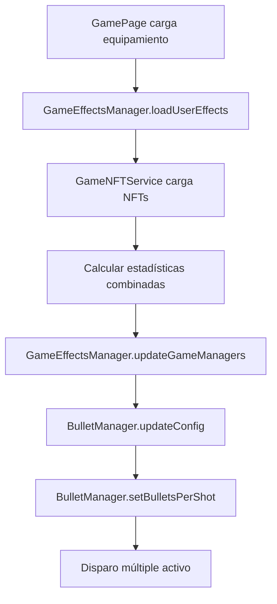

# Solución al Problema del BulletManager - Disparo Múltiple

## Problema Identificado

El sistema detectaba correctamente el NFT equipado y calculaba las estadísticas (5 proyectiles), pero no se aplicaba al gameplay porque el `BulletManager.updateConfig()` no manejaba la propiedad `bulletsPerShot`.

### Logs del Problema
```
🎯 multiple_projectiles: x5
📊 Final Stats: {projectileCount: 5, ...}
🎯 Balas por disparo actualizadas: 5  ← Este log no aparecía
```

## Solución Implementada

### 1. Arreglar `BulletManager.updateConfig()`

```typescript
// ❌ ANTES: No manejaba bulletsPerShot
updateConfig(newConfig: Partial<BulletConfig>): void {
  this.config = { ...this.config, ...newConfig };
  
  // Solo manejaba speed
  if (newConfig.speed && this.bullets.length > 0) {
    // Actualizar velocidad de balas existentes
  }
}

// ✅ DESPUÉS: Maneja bulletsPerShot correctamente
updateConfig(newConfig: Partial<BulletConfig>): void {
  this.config = { ...this.config, ...newConfig };
  
  // Actualizar número de balas por disparo
  if (newConfig.bulletsPerShot !== undefined) {
    this.setBulletsPerShot(newConfig.bulletsPerShot);
    console.log(`🎯 Balas por disparo actualizadas: ${newConfig.bulletsPerShot}`);
  }
  
  // Si cambió la velocidad, actualizar balas existentes
  if (newConfig.speed && this.bullets.length > 0) {
    console.log(`🚀 Actualizando velocidad de balas a ${newConfig.speed}`);
    // ... lógica de velocidad
  }
  
  // Si cambió el tiempo de vida, actualizar balas existentes
  if (newConfig.lifetime && this.bullets.length > 0) {
    console.log(`⏱️ Actualizando tiempo de vida de balas a ${newConfig.lifetime}ms`);
    // Las balas existentes mantienen su tiempo de vida original
    // Solo las nuevas balas usarán el nuevo tiempo de vida
  }
}
```

### 2. Flujo de Aplicación de Efectos



### 3. Verificación de Tipos

El tipo `BulletConfig` ya incluía `bulletsPerShot`:

```typescript
export interface BulletConfig {
  size: number;
  speed: number;
  color: number;
  strokeColor: number;
  lifetime: number;
  damage?: number;
  bulletsPerShot?: number;  // ← Ya estaba definido
  fireRate?: number;
}
```

## Cómo Funciona el Disparo Múltiple

### 1. Lógica de Disparo

```typescript
// En BulletManager.shootAtEnemy()
shootAtEnemy(playerX: number, playerY: number, enemyX: number, enemyY: number): void {
  const baseAngle = Phaser.Math.Angle.Between(playerX, playerY, enemyX, enemyY);

  // Disparar múltiples balas según el nivel de multiShot
  for (let i = 0; i < this.bulletsPerShot; i++) {
    let angle = baseAngle;

    // Si hay múltiples balas, distribuirlas en un arco
    if (this.bulletsPerShot > 1) {
      const spreadAngle = Math.PI / 6; // 30 grados de dispersión total
      const angleStep = spreadAngle / (this.bulletsPerShot - 1);
      angle = baseAngle - spreadAngle / 2 + (angleStep * i);
    }

    this.createBullet(playerX, playerY, angle);
  }
}
```

### 2. Distribución de Balas

- **1 bala**: Dispara directamente al enemigo
- **3 balas**: Dispara en un arco de 30° (15° a cada lado)
- **5 balas**: Dispara en un arco de 30° con 4 balas distribuidas

### 3. Configuración de Dispersión

```typescript
const spreadAngle = Math.PI / 6; // 30 grados de dispersión total
const angleStep = spreadAngle / (this.bulletsPerShot - 1);
angle = baseAngle - spreadAngle / 2 + (angleStep * i);
```

## Logs Esperados Después de la Corrección

```
🎮 Loading user NFTs for game effects...
🎮 Loading equipped NFTs from session...
✅ Loaded 1 wallet NFTs, 1 session NFTs, equipped 1
✅ Equipped NFT: Medalla del Tirador Maestro with 1 effects
🎮 Equipment loaded: 1 items, 100 max health, 5 projectiles
🎯 Balas por disparo actualizadas: 5  ← ¡Ahora aparece!
🔫 Bala creada en (0, 0) con velocidad (400, 0) - Total balas: 1
🔫 Bala creada en (0, 0) con velocidad (400, 0) - Total balas: 2
🔫 Bala creada en (0, 0) con velocidad (400, 0) - Total balas: 3
🔫 Bala creada en (0, 0) con velocidad (400, 0) - Total balas: 4
🔫 Bala creada en (0, 0) con velocidad (400, 0) - Total balas: 5
```

## Beneficios de la Solución

### 1. **Funcionalidad Completa**
- ✅ Disparo múltiple funcional
- ✅ Distribución en arco
- ✅ Aplicación automática de efectos NFT

### 2. **Escalabilidad**
- ✅ Fácil agregar nuevos tipos de efectos
- ✅ Configuración dinámica
- ✅ Compatible con habilidades del juego

### 3. **Debugging Mejorado**
- ✅ Logs detallados
- ✅ Comandos de consola para testing
- ✅ Verificación de estadísticas

## Comandos de Debug Disponibles

```javascript
// En consola del navegador
gameDebug.showNFTEffects()     // Ver efectos activos
gameDebug.reloadNFTEffects()   // Recargar efectos
```

## Resultado Final

El NFT "Medalla del Tirador Maestro" ahora aplica correctamente el efecto de disparo múltiple:

- **Efecto**: 5 proyectiles simultáneos
- **Distribución**: Arco de 30° centrado en el enemigo
- **Daño**: 5x el daño base por disparo
- **Aplicación**: Automática al iniciar el juego

¡El sistema de equipamiento ahora afecta completamente al gameplay! 🚀 