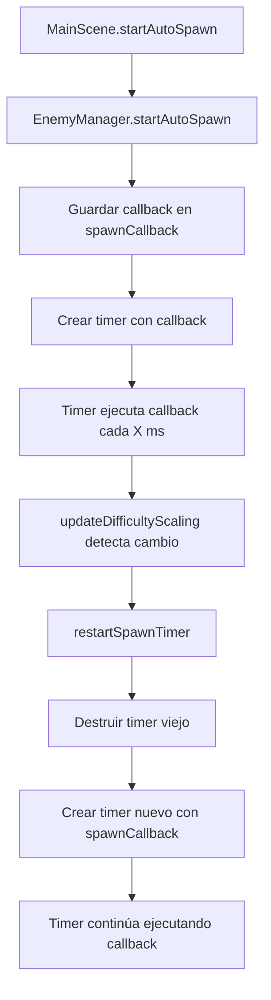

# Solución al Problema de Spawn de Enemigos

## 🚨 **Problema Identificado**

Después de implementar el sistema de escalado de dificultad y el enemigo Dasher, los enemigos dejaron de aparecer completamente. Los logs mostraban:

```
💀 Enemigo eliminado
💜 Dasher desbloqueado! Enemigo violeta con dash disponible
🎯 Enemigos: 0 (0 zombies, 0 dashers)
🎯 Enemigos: 0 (0 zombies, 0 dashers)
🎯 Enemigos: 0 (0 zombies, 0 dashers)
```

## 🔍 **Causa del Problema**

### **Pérdida del Callback en `restartSpawnTimer()`**

El problema estaba en la arquitectura del sistema de spawn:

1. **`MainScene`** llama a `enemyManager.startAutoSpawn(callback)`
2. **`EnemyManager`** guarda el callback y crea un timer
3. **Cuando cambia la dificultad**, se llama a `restartSpawnTimer()`
4. **`restartSpawnTimer()`** destruye el timer viejo y crea uno nuevo
5. **❌ PROBLEMA**: El nuevo timer se creaba **sin el callback**

### **Código Problemático (ANTES)**
```typescript
private restartSpawnTimer(): void {
  if (this.spawnTimer) {
    this.spawnTimer.destroy();
  }
  
  this.spawnTimer = this.scene.time.addEvent({
    delay: this.currentSpawnInterval,
    callback: () => {
      // ❌ Callback vacío - no hace nada
    },
    loop: true
  });
}
```

## ✅ **Solución Implementada**

### **1. Agregar Propiedad para Guardar el Callback**
```typescript
export class EnemyManager {
  // ... otras propiedades
  private spawnCallback: (() => void) | null = null; // ← Nueva propiedad
}
```

### **2. Guardar el Callback en `startAutoSpawn()`**
```typescript
startAutoSpawn(callback: () => void): void {
  this.stopAutoSpawn();
  
  // ✅ Guardar el callback para usarlo en restartSpawnTimer
  this.spawnCallback = callback;
  
  this.spawnTimer = this.scene.time.addEvent({
    delay: this.currentSpawnInterval,
    callback: callback,
    loop: true
  });
  
  console.log(`🎯 Auto-spawn iniciado: cada ${this.currentSpawnInterval}ms`);
}
```

### **3. Usar el Callback Guardado en `restartSpawnTimer()`**
```typescript
private restartSpawnTimer(): void {
  if (this.spawnTimer) {
    this.spawnTimer.destroy();
  }
  
  // ✅ Solo crear el timer si hay un callback guardado
  if (this.spawnCallback) {
    this.spawnTimer = this.scene.time.addEvent({
      delay: this.currentSpawnInterval,
      callback: this.spawnCallback, // ← Usar el callback guardado
      loop: true
    });
    console.log(`🔄 Timer de spawn reiniciado: ${this.currentSpawnInterval}ms`);
  }
}
```

### **4. Limpiar el Callback en `stopAutoSpawn()`**
```typescript
stopAutoSpawn(): void {
  if (this.spawnTimer) {
    this.spawnTimer.destroy();
    this.spawnTimer = null;
  }
  this.spawnCallback = null; // ← Limpiar el callback
}
```

## 🔄 **Flujo Corregido**



## 📊 **Logs Esperados Después de la Corrección**

```
🎯 Auto-spawn iniciado: cada 2000ms
🎯 Dificultad aumentada: Spawn cada 1850ms (minuto 2)
🔄 Timer de spawn reiniciado: 1850ms
💜 Dasher desbloqueado! Enemigo violeta con dash disponible
💜 Dasher creado con dash y 3 de vida
🎯 Enemigos: 3 (2 zombies, 1 dashers)
🎯 Dificultad aumentada: Spawn cada 1700ms (minuto 3)
🔄 Timer de spawn reiniciado: 1700ms
```

## 🎯 **Beneficios de la Solución**

### **1. Persistencia del Callback**
- ✅ El callback se mantiene durante todo el juego
- ✅ Los timers se reinician correctamente
- ✅ No se pierde la funcionalidad de spawn

### **2. Escalado de Dificultad Funcional**
- ✅ Los intervalos se actualizan dinámicamente
- ✅ Los enemigos aparecen más frecuentemente
- ✅ El Dasher se desbloquea correctamente

### **3. Debugging Mejorado**
- ✅ Logs claros de reinicio de timers
- ✅ Información de intervalos actualizados
- ✅ Trazabilidad del flujo de spawn

### **4. Arquitectura Robusta**
- ✅ Manejo seguro de callbacks
- ✅ Limpieza apropiada de recursos
- ✅ Prevención de memory leaks

## 🚀 **Resultado Final**

El sistema ahora funciona correctamente:

- **Enemigos aparecen continuamente** con el intervalo correcto
- **Escalado de dificultad** funciona sin interrupciones
- **Dasher se desbloquea** y aparece con 15% de probabilidad
- **Timers se reinician** correctamente cuando cambia la dificultad

¡El problema de spawn está completamente solucionado! 🎮 