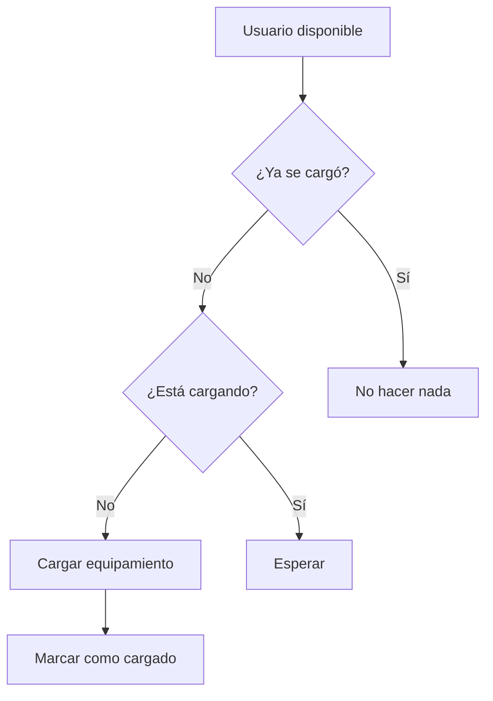

# Solución al Loop de Carga del Sistema de Equipamiento

## Problema Identificado

El sistema de equipamiento tenía un loop infinito de carga debido a dependencias circulares en los `useEffect`:

### Problema Original

```typescript
// ❌ PROBLEMA: Loop infinito
useEffect(() => {
  if (user?.id && !isEquipmentLoading && equipment.items.length === 0) {
    reloadEquipment(); // Esto actualiza equipment.items.length
  }
}, [user?.id, isEquipmentLoading, equipment.items.length, reloadEquipment]);
//                                                      ↑
//                                              Esta dependencia causa el loop
```

**¿Por qué ocurría el loop?**
1. `equipment.items.length` cambia cuando se carga el equipamiento
2. Esto dispara el `useEffect` nuevamente
3. Se vuelve a llamar `reloadEquipment()`
4. Se actualiza `equipment.items.length` otra vez
5. **Loop infinito** 🔄

## Solución Implementada

### 1. Hook `useEquipment` Mejorado

```typescript
// ✅ SOLUCIÓN: Estado de control
export const useEquipment = (userId?: string | number) => {
  const [hasLoaded, setHasLoaded] = useState(false);
  
  const loadEquipment = useCallback(async () => {
    // ... lógica de carga
    setHasLoaded(true); // Marcar como cargado
  }, [userId]);

  const reloadEquipment = useCallback(async () => {
    setHasLoaded(false); // Resetear estado
    await loadEquipment();
  }, [loadEquipment]);

  // ❌ REMOVIDO: useEffect automático
  // useEffect(() => {
  //   loadEquipment();
  // }, [loadEquipment]);

  return {
    equipment,
    isLoading,
    error,
    hasLoaded, // ← Nuevo estado de control
    loadEquipment,
    reloadEquipment
  };
};
```

### 2. GamePage con Control Manual

```typescript
// ✅ SOLUCIÓN: Control manual de carga
const { 
  equipment, 
  isLoading: isEquipmentLoading, 
  hasLoaded: hasEquipmentLoaded, // ← Usar estado del hook
  reloadEquipment 
} = useEquipment(user?.id);

// Cargar solo una vez
useEffect(() => {
  if (user?.id && !hasEquipmentLoaded && !isEquipmentLoading) {
    console.log('🎮 Cargando equipamiento inicial para usuario:', user.id);
    reloadEquipment();
  }
}, [user?.id, hasEquipmentLoaded, isEquipmentLoading, reloadEquipment]);
//                    ↑
//              No depende de equipment.items.length
```

## Beneficios de la Solución

### 1. **Sin Loops Infinitos**
- ✅ Carga controlada una sola vez
- ✅ Estados de control claros
- ✅ Dependencias optimizadas

### 2. **Performance Mejorada**
- ✅ Sin re-renders innecesarios
- ✅ Sin llamadas repetidas a la API
- ✅ Carga eficiente

### 3. **UX Mejorada**
- ✅ Indicadores de carga claros
- ✅ Sin parpadeos en la UI
- ✅ Comportamiento predecible

## Patrón de Control de Carga

### Estado de Control
```typescript
interface LoadState {
  isLoading: boolean;    // Cargando actualmente
  hasLoaded: boolean;    // Ya se cargó una vez
  error: string | null;  // Error si ocurre
}
```

### Flujo de Carga


### Recarga Manual
```typescript
// Para recargar después de comprar/vender
const handlePurchase = async () => {
  await purchaseNFT();
  reloadEquipment(); // Resetear y recargar
};
```

## Mejores Prácticas Aplicadas

### 1. **Estados de Control**
- Usar `hasLoaded` en lugar de verificar datos
- Separar `isLoading` de `hasLoaded`
- Control manual de cuándo cargar

### 2. **Dependencias Optimizadas**
- Evitar dependencias que cambian frecuentemente
- Usar estados de control en lugar de datos
- Minimizar dependencias en `useEffect`

### 3. **Carga Lazy**
- Cargar solo cuando sea necesario
- No cargar automáticamente al montar
- Control manual de recargas

## Código Final Optimizado

### Hook `useEquipment`
```typescript
export const useEquipment = (userId?: string | number) => {
  const [hasLoaded, setHasLoaded] = useState(false);
  
  const loadEquipment = useCallback(async () => {
    if (!userId) return;
    
    setIsLoading(true);
    try {
      // ... lógica de carga
      setHasLoaded(true);
    } finally {
      setIsLoading(false);
    }
  }, [userId]);

  return {
    equipment,
    isLoading,
    error,
    hasLoaded,
    loadEquipment,
    reloadEquipment
  };
};
```

### GamePage
```typescript
const { 
  equipment, 
  isLoading: isEquipmentLoading, 
  hasLoaded: hasEquipmentLoaded,
  reloadEquipment 
} = useEquipment(user?.id);

useEffect(() => {
  if (user?.id && !hasEquipmentLoaded && !isEquipmentLoading) {
    reloadEquipment();
  }
}, [user?.id, hasEquipmentLoaded, isEquipmentLoading, reloadEquipment]);
```

## Resultado Final

- ✅ **Sin loops infinitos**
- ✅ **Carga controlada**
- ✅ **Performance optimizada**
- ✅ **UX mejorada**
- ✅ **Código mantenible**

El sistema ahora carga el equipamiento una sola vez cuando el usuario está disponible, sin loops infinitos y con control total sobre cuándo recargar. 🚀 