# Sistema de Equipamiento Escalable - MEDABOT

## Resumen

Se ha implementado un sistema de equipamiento escalable en `GamePage.tsx` que verifica automáticamente el equipamiento del usuario (NFTs por ahora, preparado para armas/items después) y aplica los efectos de forma escalable.

## Arquitectura

### 1. Hook Personalizado: `useEquipment`

```typescript
// src/hooks/useEquipment.ts
export const useEquipment = (userId?: string | number) => {
  // Carga automática de equipamiento
  // Cálculo de estadísticas combinadas
  // Gestión de efectos por tipo
}
```

**Características:**
- ✅ Carga automática de NFTs del usuario
- ✅ Cálculo de estadísticas combinadas
- ✅ Soporte para múltiples tipos de equipamiento
- ✅ Escalable para futuros items/armas

### 2. Tipos de Equipamiento

```typescript
export interface EquipmentItem {
  id: string;
  type: 'nft' | 'weapon' | 'item'; // Escalable
  name: string;
  rarity: string;
  effects: GameEffect[];
  equippedAt: number;
  slot?: string; // Para futuras expansiones
}
```

### 3. Estadísticas Calculadas

```typescript
export interface EquipmentStats {
  // Stats base
  baseHealth: number;
  baseDamage: number;
  baseSpeed: number;
  baseFireRate: number;
  baseProjectileCount: number;
  
  // Stats modificados por equipamiento
  currentHealth: number;
  maxHealth: number;
  damage: number;
  speed: number;
  fireRate: number;
  projectileCount: number;
  
  // Stats adicionales
  criticalChance: number;
  shieldStrength: number;
  bulletSpeed: number;
  bulletLifetime: number;
  magneticRange: number;
  experienceMultiplier: number;
}
```

## Flujo de Funcionamiento

### 1. Carga Inicial

```mermaid
graph TD
    A[Usuario inicia GamePage] --> B[useEquipment hook se ejecuta]
    B --> C[Verificar usuario autenticado]
    C --> D[Cargar NFTs del usuario]
    D --> E[Filtrar NFTs no en venta]
    E --> F[Convertir a EquipmentItems]
    F --> G[Calcular estadísticas combinadas]
    G --> H[Aplicar efectos al juego]
```


### 2. Aplicación de Efectos
```typescript
// En GamePage.tsx
const handleUIUpdate = useCallback((stats: GameStats) => {
  if (equipment && equipment.stats) {
    const updatedStats = {
      ...stats,
      maxHealth: equipment.stats.maxHealth,
      health: Math.min(stats.health, equipment.stats.maxHealth),
      equipment: {
        items: equipment.items.map(/* ... */),
        stats: equipment.stats
      }
    };
    setGameStats(updatedStats);
  }
}, [equipment]);
```

## Efectos Soportados

### Efectos Defensivos
- **health_boost**: Aumenta vida máxima
- **shield_strength**: Proporciona escudo adicional

### Efectos Ofensivos
- **weapon_damage_boost**: Aumenta daño de armas
- **multiple_projectiles**: Múltiples proyectiles (no stackeable)
- **fire_rate**: Velocidad de disparo
- **critical_chance**: Probabilidad crítica
- **bullet_speed**: Velocidad de balas
- **bullet_lifetime**: Duración de balas

### Efectos de Utilidad
- **movement_speed**: Velocidad de movimiento
- **magnetic_range**: Rango de atracción
- **experience_boost**: Multiplicador de experiencia

## Ejemplos de Uso

### Ejemplo 1: NFT de Disparo Múltiple
```json
{
  "name": "Medalla del Tirador Maestro",
  "type": "nft",
  "rarity": "legendary",
  "effects": [
    {
      "type": "multiple_projectiles",
      "value": 3,
      "unit": "count"
    }
  ]
}
```

**Resultado:** El jugador dispara 3 proyectiles simultáneamente desde el inicio del juego.

### Ejemplo 2: Múltiples NFTs
```json
[
  {
    "name": "Medalla de Vitalidad",
    "type": "nft",
    "rarity": "common",
    "effects": [{"type": "health_boost", "value": 15, "unit": "percentage"}]
  },
  {
    "name": "Medalla del Guerrero",
    "type": "nft", 
    "rarity": "rare",
    "effects": [{"type": "weapon_damage_boost", "value": 8, "unit": "percentage"}]
  }
]
```

**Resultado:**
- Vida: 100 → 115 HP (+15%)
- Daño: 10 → 12 por disparo (+20% por rareza rara)

## Escalabilidad

### Agregar Nuevos Tipos de Equipamiento

```typescript
// En useEquipment.ts
const equipmentItems: EquipmentItem[] = [
  // NFTs existentes
  ...equippedNFTs.map(/* ... */),
  
  // Nuevos tipos (futuro)
  ...weapons.map(weapon => ({
    id: weapon.id,
    type: 'weapon',
    name: weapon.name,
    rarity: weapon.rarity,
    effects: weapon.effects,
    equippedAt: Date.now(),
    slot: 'weapon'
  })),
  
  ...items.map(item => ({
    id: item.id,
    type: 'item',
    name: item.name,
    rarity: item.rarity,
    effects: item.effects,
    equippedAt: Date.now(),
    slot: item.slot
  }))
];
```

### Agregar Nuevos Efectos

```typescript
// En calculateCombinedStats()
switch (effectType) {
  // Efectos existentes...
  
  case 'new_effect_type':
    stats.newProperty = baseStats.baseNewProperty + totalValue;
    break;
}
```

## UI Integrada

### 1. Indicadores de Estado
- **Loading**: Muestra cuando se está cargando el equipamiento
- **Error**: Muestra errores de carga
- **Equipamiento Activo**: Lista de items equipados en el HUD

### 2. Menú del Juego
- **Estadísticas Detalladas**: Muestra stats modificados por equipamiento
- **Lista de Items**: Items equipados con sus efectos
- **Información de Rareza**: Colores por rareza

### 3. HUD del Juego
- **Vida Modificada**: Muestra vida máxima aumentada por equipamiento
- **Efectos Activos**: Lista de efectos NFT/equipamiento activos
- **Contador de Items**: Número total de items equipados

## Comandos de Debug

```javascript
// En consola del navegador
// Ver equipamiento cargado
console.log('Equipment:', equipment);

// Recargar equipamiento
reloadEquipment();

// Ver estadísticas calculadas
console.log('Stats:', equipment.stats);
```

## Ventajas del Sistema

### 1. Escalabilidad
- ✅ Fácil agregar nuevos tipos de equipamiento
- ✅ Fácil agregar nuevos efectos
- ✅ Soporte para slots de equipamiento
- ✅ Sistema de rareza integrado

### 2. Performance
- ✅ Carga una sola vez al iniciar
- ✅ Cálculos cached
- ✅ Actualización en tiempo real
- ✅ Optimizado con useCallback

### 3. UX
- ✅ Carga automática
- ✅ Indicadores visuales
- ✅ Información detallada
- ✅ Manejo de errores

### 4. Mantenibilidad
- ✅ Código modular
- ✅ Tipos TypeScript
- ✅ Documentación completa
- ✅ Hooks reutilizables

## Futuras Expansiones

### 1. Sistema de Armas
```typescript
interface Weapon extends EquipmentItem {
  type: 'weapon';
  weaponType: 'pistol' | 'rifle' | 'shotgun';
  damage: number;
  fireRate: number;
  ammoCapacity: number;
}
```

### 2. Sistema de Items
```typescript
interface Item extends EquipmentItem {
  type: 'item';
  itemType: 'consumable' | 'permanent' | 'temporary';
  duration?: number;
  cooldown?: number;
}
```

### 3. Sistema de Slots
```typescript
interface EquipmentSlots {
  weapon: EquipmentItem | null;
  armor: EquipmentItem | null;
  accessory1: EquipmentItem | null;
  accessory2: EquipmentItem | null;
}
```

## Estado Actual

- ✅ Sistema base implementado
- ✅ Integración con NFTs
- ✅ UI completa
- ✅ Cálculos de estadísticas
- ✅ Manejo de errores
- ✅ Documentación
- 🔄 Preparado para armas/items
- 🔄 Preparado para slots

El sistema está completamente funcional y listo para expandirse con nuevos tipos de equipamiento. 🚀 