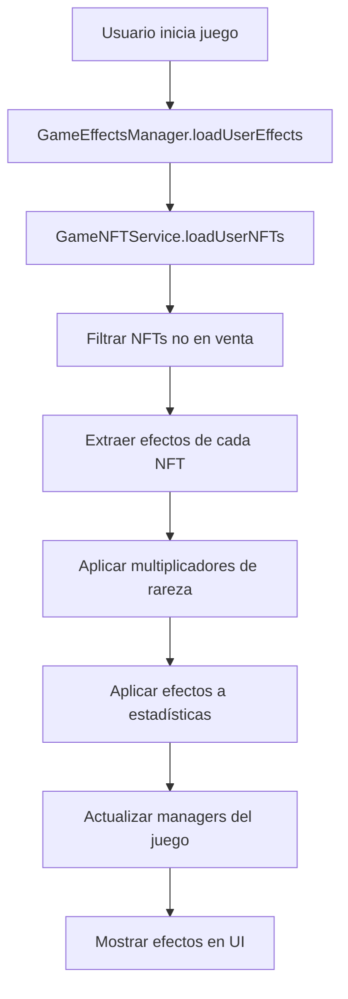

# Guía de Mecánicas de NFT en el Juego

## Resumen del Sistema

El sistema de NFTs en MEDABOT permite que los NFTs del usuario se conviertan automáticamente en mejoras de juego. Cada NFT tiene efectos específicos que se aplican cuando el jugador entra al juego.

## Cómo Funciona

### 1. Carga Automática de NFTs
- Al iniciar el juego, se cargan automáticamente todos los NFTs del usuario desde Strapi
- Solo se equipan NFTs que NO están en venta (`is_listed_for_sale: "False"`)
- Los NFTs se procesan y sus efectos se aplican inmediatamente

### 2. Tipos de Efectos Disponibles

#### Efectos Defensivos
- **health_boost**: Aumenta la vida máxima del jugador
- **shield_strength**: Proporciona escudo adicional

#### Efectos Ofensivos  
- **weapon_damage_boost**: Aumenta el daño de las armas
- **multiple_projectiles**: Permite disparar múltiples proyectiles
- **fire_rate**: Aumenta la velocidad de disparo
- **critical_chance**: Añade probabilidad de golpe crítico

#### Efectos de Movilidad
- **movement_speed**: Aumenta la velocidad de movimiento

#### Efectos de Utilidad
- **mining_efficiency**: Mejora la eficiencia de minería (futuro)
- **experience_boost**: Multiplica la experiencia ganada
- **magnetic_range**: Aumenta el rango de atracción de experiencia

### 3. Sistema de Rareza

Los efectos se multiplican según la rareza del NFT:

```typescript
const rarityMultipliers = {
  common: 1.0,     // Sin multiplicador
  rare: 1.5,       // +50% de efectividad
  epic: 2.0,       // +100% de efectividad  
  legendary: 3.0   // +200% de efectividad
}
```

**Ejemplo:**
- NFT Común con +15% vida = +15% vida final
- NFT Legendario con +15% vida = +45% vida final (15% × 3.0)

### 4. Sistema de Stacking

#### Efectos Stackables
La mayoría de efectos se pueden acumular:
- **health_boost**: Hasta 5 stacks
- **weapon_damage_boost**: Hasta 5 stacks  
- **movement_speed**: Hasta 3 stacks
- **experience_boost**: Hasta 3 stacks

#### Efectos No Stackables
Algunos efectos toman solo el valor más alto:
- **multiple_projectiles**: Solo 1 activo (el mayor)

### 5. Estructura de NFT para Efectos

Los NFTs deben tener esta estructura en su metadata:

```json
{
  "metadata": {
    "name": "Medalla de Vitalidad",
    "rarity": "common",
    "game_effect": {
      "type": "health_boost",
      "value": 15,
      "unit": "percentage"
    }
  }
}
```

## Implementación Técnica

### Managers Involucrados

1. **GameNFTService**: Carga y procesa NFTs del usuario
2. **GameEffectsManager**: Aplica efectos a las estadísticas del juego
3. **MainScene**: Coordina la carga de efectos al iniciar

### Flujo de Aplicación



### Escalabilidad

El sistema está diseñado para ser escalable:

- **Nuevos tipos de efectos**: Solo agregar al enum `GameEffectType`
- **Nuevas rarezas**: Agregar al objeto `rarityMultipliers`
- **Nuevos NFTs**: Automáticamente procesados si tienen `game_effect`

## Comandos de Debug

En modo desarrollo, están disponibles estos comandos de consola:

```javascript
// Ver efectos activos
gameDebug.showNFTEffects()

// Recargar efectos (útil después de comprar NFTs)
gameDebug.reloadNFTEffects()
```

## Ejemplos de NFTs

### NFT Básico (Común)
```json
{
  "metadata": {
    "name": "Medalla de Vitalidad",
    "rarity": "common",
    "game_effect": {
      "type": "health_boost", 
      "value": 15,
      "unit": "percentage"
    }
  }
}
```
**Resultado**: +15% vida máxima

### NFT Avanzado (Legendario)
```json
{
  "metadata": {
    "name": "Medalla del Tirador Maestro",
    "rarity": "legendary",
    "game_effect": {
      "type": "multiple_projectiles",
      "value": 3,
      "unit": "count"
    }
  }
}
```
**Resultado**: Dispara 3 proyectiles simultáneamente

## Integración con UI

Los efectos se muestran en tiempo real en la UI del juego:

- **Sección "EFECTOS NFT ACTIVOS"** en el HUD principal
- **Colores por rareza**: Púrpura (legendario), Naranja (épico), Azul (raro), Gris (común)
- **Valores en tiempo real**: Se actualizan automáticamente

## Consideraciones de Rendimiento

- Los efectos se calculan una vez al cargar el juego
- Solo se recalculan cuando se compran/venden NFTs
- La UI se actualiza en cada frame pero los cálculos son cached

## Futuras Expansiones

### Efectos Temporales
```json
{
  "game_effect": {
    "type": "damage_boost",
    "value": 50,
    "unit": "percentage", 
    "duration": 30,  // 30 segundos
    "cooldown": 120  // 2 minutos de cooldown
  }
}
```

### Efectos Condicionales
```json
{
  "game_effect": {
    "type": "critical_chance",
    "value": 25,
    "conditions": {
      "health_below": 50  // Solo activo con menos del 50% de vida
    }
  }
}
```

### Sinergias entre NFTs
```json
{
  "game_effect": {
    "type": "weapon_damage_boost",
    "value": 20,
    "synergy": {
      "with": "health_boost",
      "bonus": 10  // +10% adicional si también tiene health_boost
    }
  }
}
```